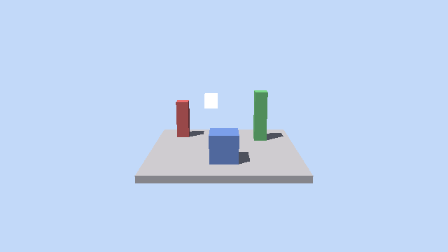

# Path-Traced Voxel FPS (working title)

An experimental, single-player FPS in the spirit of **GoldenEye 007 (N64)**, built on
**Godot 4.6** but replacing two of Godot's core subsystems with from-scratch implementations:

- A **custom Vulkan hardware ray-traced path tracer** (Godot's 3D renderer is *not* used).
- A **custom geometric acoustic ray tracer** for physically-correct audio propagation.

World levels are **coarse voxel blocks**, NPCs are **Mixamo skinned meshes**, and all materials
are **PBR**. Performance is explicitly not an early priority; the renderer is built for
correctness and image quality first.

> The previous contents of this repository (the 2014 *GitHut* D3.js website) have been moved to
> [`legacy-githut/`](./legacy-githut) and are unrelated to this project.

## Target platform

Fixed and generous, so we can assume hardware ray tracing is always available:

- **Linux** x86_64
- **> 16 CPU cores**, **> 64 GB RAM**
- **NVIDIA RTX 4090 or newer** (single GPU)
- Vulkan with `VK_KHR_ray_tracing_pipeline`, `VK_KHR_acceleration_structure`, `VK_KHR_ray_query`

## Architecture at a glance

Godot owns the window, scene tree, editor/import pipeline, Jolt physics, navigation, animation,
input, and UI. Our **C++ GDExtension** owns a *separate* RT-enabled `VkDevice` on the same GPU,
path-traces the scene into an offscreen `VkImage`, and hands it to Godot (via external-memory
import + a shared timeline semaphore) to be composited as a fullscreen texture under the UI.

See [`docs/ARCHITECTURE.md`](./docs/ARCHITECTURE.md) for the full design and
[`docs/ROADMAP.md`](./docs/ROADMAP.md) for the milestone plan.

```
game/        Godot 4.6 project (scenes, scripts, assets, the .gdextension descriptor)
native/      C++ GDExtension: renderer, voxel engine, skinning, audio, Godot bridge
  src/bridge/  scene extraction + external-memory VkImage / semaphore handoff
  src/render/  Vulkan device, acceleration structures, RT pipeline, ReSTIR, denoise
  src/voxel/   chunking, greedy meshing, BLAS build
  src/skin/    GPU skinning + BLAS refit for Mixamo characters
  src/audio/   geometric acoustic ray tracer, convolution + HRTF
  src/core/    shared utilities (logging, etc.)
  shaders/     .rgen/.rchit/.rmiss/.comp (compiled to SPIR-V)
  thirdparty/  godot-cpp, VMA, OIDN (git submodules)
docs/        architecture, roadmap, build notes
legacy-githut/  the old, unrelated GitHut website
```

## Building

The native extension requires a workstation with the GPU toolchain installed (it does **not**
build in a CPU-only CI container). See [`docs/BUILD.md`](./docs/BUILD.md) for full prerequisites
and steps. In short:

```bash
git submodule update --init --recursive
cmake -S native -B native/build -DCMAKE_BUILD_TYPE=Debug
cmake --build native/build -j
# then open game/project.godot in Godot 4.6
```

## Testing

The renderer-agnostic CPU core (voxel engine, greedy mesher, material palette) is unit-tested
with **doctest** and runs without a GPU or the Vulkan SDK — including in CI:

```bash
./scripts/run_tests.sh          # configure + build + ctest
```

There is also a **CPU reference path tracer** (`native/tools/cpu_reference`) that meshes a voxel
scene and renders it with the same math the GPU path tracer will use — its output is the golden
image for verification:

```bash
cmake -S native/tools -B native/build-tools && cmake --build native/build-tools -j
./native/build-tools/cpu_reference out.ppm        # built-in demo scene
./native/build-tools/cpu_reference out.ppm a.vox  # or a MagicaVoxel model
```



The full native GDExtension (godot-cpp + Vulkan + RTX) is built separately on a Vulkan-capable
workstation; see [`docs/BUILD.md`](./docs/BUILD.md). CI gates the CPU-core tests
(`.github/workflows/ci.yml`).

## License

MIT — see [`LICENCE`](./LICENCE).
